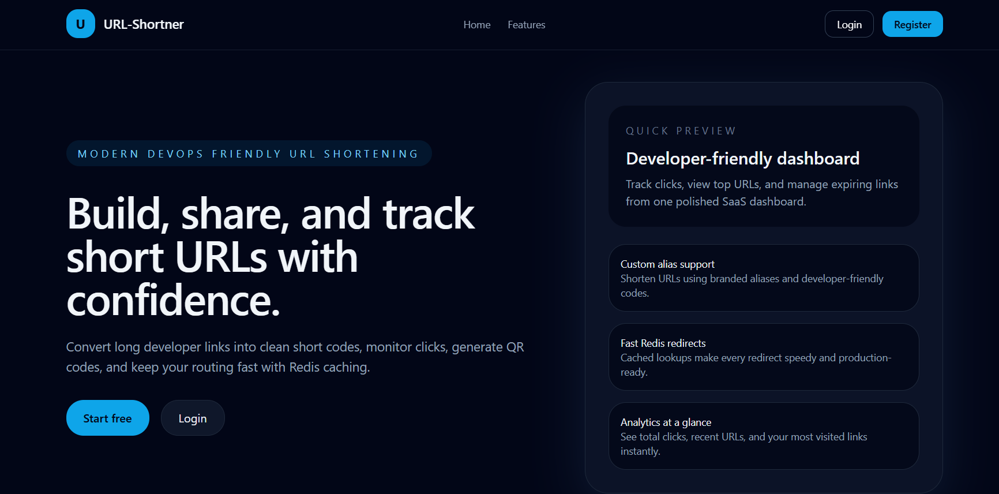
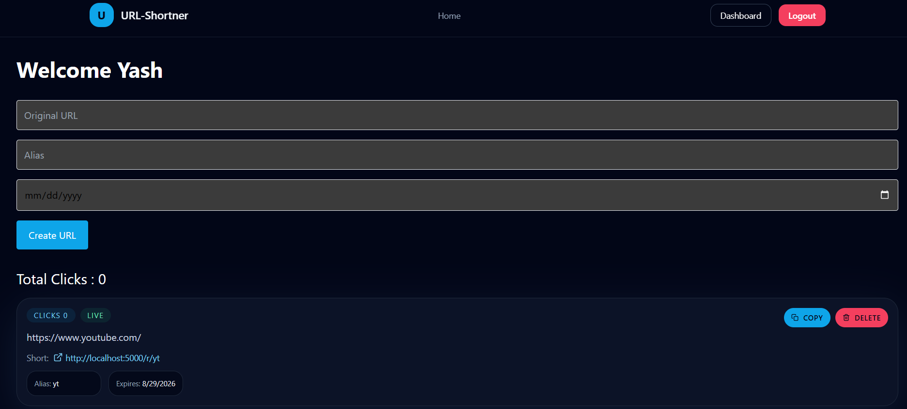

# DevOps-Friendly URL Shortener

A full-stack URL shortener application built with React, Express, MongoDB, Redis, and Docker. The project allows users to create shortened links, add custom aliases, track click statistics, and manage their URLs from a dashboard.

## Overview

This project demonstrates a practical full-stack application with:

- User authentication with JWT
- Secure URL shortening and alias support
- Dashboard analytics for total and recent clicks
- Redis-based caching for redirect efficiency
- MongoDB persistence for URL metadata
- Docker-based local development environment

The application is designed to be easy to run locally and suitable as a portfolio or learning project for modern web and DevOps workflows.

## Features

- User registration and login
- Protected dashboard with user-specific URLs
- Short link creation with optional custom alias
- URL expiration support
- QR code generation for shortened URLs
- Click tracking for analytics
- Redis caching for faster redirect lookups
- Docker Compose setup for backend, frontend, MongoDB, and Redis
- Responsive UI built with React + Tailwind CSS

## Tech Stack

### Frontend

- React
- Vite
- Redux Toolkit
- React Router
- Tailwind CSS
- Axios

### Backend

- Node.js
- Express
- MongoDB with Mongoose
- Redis
- JWT authentication
- Helmet, CORS, rate limiting

### DevOps / Infrastructure

- Docker
- Docker Compose

## How the Project Works

1. A user registers or logs in.
2. The frontend sends authenticated requests to the Express API.
3. The backend validates the original URL and creates a short code.
4. The URL record is stored in MongoDB with metadata such as creator, expiry date, and click count.
5. Redirect requests are served through the backend route `/r/:code`.
6. Redis caches the lookup result for fast repeated redirects.
7. The dashboard fetches all shortened URLs and analytics for the logged-in user.

## Architecture

```text
Frontend (React + Vite)
        |
        v
Express API (Node.js)
   |--------> MongoDB (URL storage)
   |--------> Redis (cache for redirect lookups)
   |
   +--------> JWT auth and protected dashboard routes
```

## Project Structure

```text
url-shortner/
├── backend/
│   ├── src/
│   ├── Dockerfile
│   ├── .env
│   ├── package.json
│   └── ...
├── frontend/
│   ├── src/
│   ├── Dockerfile
│   ├── package.json
│   └── ...
├── docker-compose.yml
├── README.md
└── ...
```

## Screenshots

### Landing Page

> Add a screenshot of the landing page here.



### Dashboard

> Add a screenshot of the dashboard here.



### URL Creation Flow

> Add a screenshot showing URL creation and analytics here.


## Prerequisites

Before running the project, make sure you have:

- Node.js 20+
- npm
- Docker and Docker Compose
- Git

## Local Development Setup

### 1. Clone the repository

```bash
git clone <repository-url>
cd url-shortner
```

### 2. Start the application with Docker Compose

```bash
docker compose up --build
```

This will start:

- Frontend: http://localhost:4173
- Backend API: http://localhost:5000
- MongoDB: localhost:27017
- Redis: localhost:6379

### 3. Access the app

Open the frontend in the browser:

```text
http://localhost:4173
```

## Running Manually (without Docker)

### Backend

```bash
cd backend
npm install
npm run dev
```

### Frontend

```bash
cd frontend
npm install
npm run dev
```

Make sure MongoDB and Redis are running locally before starting the backend.

## API Endpoints

### Authentication

- `POST /api/auth/register` - Register a new user
- `POST /api/auth/login` - Login a user

### URL Management

- `GET /api/urls` - Get all URLs for the logged-in user
- `GET /api/urls/analytics` - Get analytics summary
- `POST /api/urls` - Create a new shortened URL
- `DELETE /api/urls/:id` - Delete a shortened URL

### Redirect

- `GET /r/:code` - Redirect a short code to the original URL

## Dashboard Features

The dashboard allows users to:

- View all created short links
- Copy shortened URLs
- Delete links
- View total click counts
- See recent and most-visited links
- Create new links with optional custom aliases and expiry dates

## Security Notes

- JWT is used for authenticated routes.
- CORS is configured for the frontend origin.
- Rate limiting is enabled for API protection.
- Helmet is enabled for secure HTTP headers.
- URL validation prevents obviously invalid long URLs.

## Future Improvements

- Add email verification
- Add user profile settings
- Add advanced analytics charts
- Add link expiration notifications
- Add QR code download/export
- Add admin dashboard and user management
- Add deployment config for Vercel, Render, or Railway

## License

This project is for educational and portfolio use. You can modify and extend it according to your needs.

## Contributing

Contributions are welcome. If you want to improve the project:

1. Fork the repository
2. Create a feature branch
3. Commit your changes
4. Open a pull request

## Contact

For questions or collaboration, feel free to reach out through the project repository or your preferred contact channel.

---

> Replace the screenshot placeholders above with real images once the app is ready for presentation.
